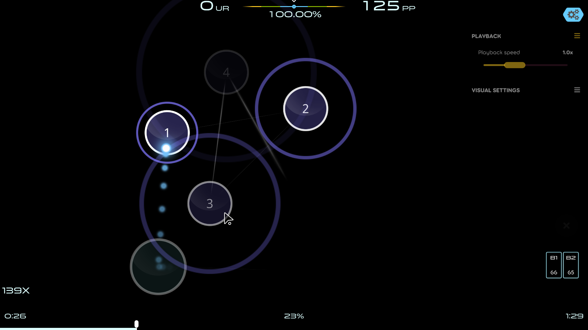

# osu-pomp-skin

My custom skin for the game [osu!](https://github.com/ppy/osu) (yes, the exclamation mark is part of the name).



## Characteristics

- minimalistic
  - does not even have a health bar
  - uses the default element in most cases
- skins osu!standard only
- acc meter positioned on top of the screen instead of the bottom
- made specifically for osu!lazer
- uses [HD images](https://github.com/ppy/osu-wiki/blob/master/wiki/Skinning/FAQ/en.md#hd-images) only

## Commands

The files are not usable on their own.
The have to be parsed and compressed down to a `.osk` file.
Run the following commands to generate the skin archive.

> Note that the commands assume they are called from the project root

Install dependencies:

```bash
pip install -r requirements.txt
```

Build skin:

```bash
python src
```

## What's in it?

Though no images have a `@2x` postfix, they are all HD images. The postfix are added automatically during the build process.

- [sounds](https://github.com/ppy/osu-wiki/blob/master/wiki/Skinning/Sounds/en.md)
- [hitcircles](https://github.com/ppy/osu-wiki/blob/master/wiki/Skinning/osu!/en.md#hit-circles)
- [cursor](https://github.com/ppy/osu-wiki/blob/master/wiki/Skinning/Interface/en.md#cursor)
- [hit bursts](https://github.com/ppy/osu-wiki/blob/master/wiki/Skinning/Interface/en.md#hit-bursts)
- [default numbers](https://github.com/ppy/osu-wiki/blob/master/wiki/Skinning/osu!/en.md#default-numbers)
- [slider](https://github.com/ppy/osu-wiki/blob/master/wiki/Skinning/osu!/en.md#slider)
- [spinner](https://github.com/ppy/osu-wiki/blob/master/wiki/Skinning/osu!/en.md#spinner)
- audio (TODO)

## Resources

- [osu! wiki page about skinning](https://osu.ppy.sh/wiki/en/Skinning)
- some assets are from:
  - [vaxei's skin](https://drive.google.com/file/d/1JRDbxtEVFYMgt9ls4rvIRs2v0IfBddFO/view) (audio and followpoints)
  - [flyingtuna's skin](https://drive.google.com/file/d/1SVtUUvo4o2DUwQ1Pf2Xb0v4eDblvvovq/view) (hit circles and slider colors)
  - [whitecat's skin](https://drive.google.com/file/d/1A9Ktx7MY-UP5iOGTTHsyQP622zDOKqfe/view) (cursor)
  - [osu!pure skin](https://www.reddit.com/r/OsuSkins/comments/kzv7s4/osupure_169_hdsd_osustandard) (hit bursts)

## My favorite difficulty settings

This is the difficulty adjustment settings I most commonly use, and is what the skin is optimized for:

- CS 5
- HP 10
- OD 9
- AR 9.4

## License

<ins>The source code of this project</ins>\* is available under the MIT License.

\*Excluding images and fonts.

Fonts:

- [Source Code Pro](https://fonts.google.com/specimen/Source+Code+Pro): Open Font License (OFL)
- [Noto Sans](https://fonts.google.com/noto/specimen/Noto+Sans): Open Font License (OFL)
